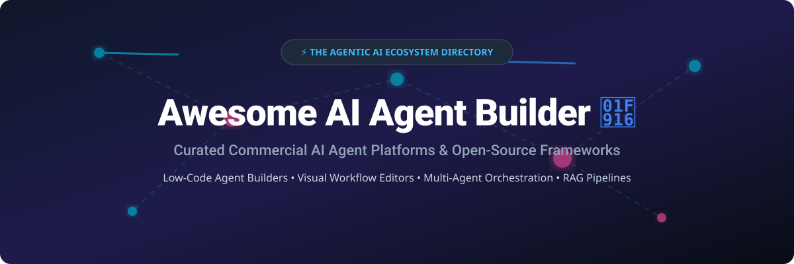

# Awesome-AI-Agent-Builder 🤖 🛠️

  

  
  
  
  
  
  

---

## 🌟 Top AI Agent Builder Ecosystem

**Curated List of Commercial AI Agent Platforms & Open-Source Agent Frameworks**  
*Focused on Low-Code Agent Builders, Visual Workflow Editors, Multi-Agent Orchestration, Tool Integration, Memory & Self-Hosted Agent Runtimes* 🚀

**Last updated: October 2026** 📅

---

### 📌 Overview & SEO Summary

Welcome to the ultimate community-curated directory of **AI agent builders**, **open-source agent frameworks**, and **no-code AI automation platforms**. Whether you are searching for enterprise-grade SaaS tools (*Microsoft Copilot Studio*, *Salesforce Agentforce*, *OpenAI Custom GPTs*, *Dify Cloud*) or privacy-first, self-hostable open-source frameworks (*n8n*, *Dify*, *browser-use*, *Langflow*, *MetaGPT*, *AutoGen*, *CrewAI*, *smolagents*), this repository provides comprehensive pricing, feature comparisons, and star metrics for modern AI software architecture.

**Key Market Context:** 📈
- **n8n** leads open-source automation with **176K+ GitHub_Stars** — acting as the primary action layer for autonomous agentic workflows.
- **Dify** is the premier open-source LLMOps platform with **130K+ GitHub_Stars** featuring visual drag-and-drop RAG building.
- **browser-use** has rapidly surpassed **117K+ GitHub_Stars** as the standard for agentic web browsing and browser automation.
- **CrewAI** and **AutoGen** dominate role-based multi-agent orchestration for enterprise automation.

---

## 📑 Table of Contents

- [🏢 SaaS & Commercial Platforms](#-saas--commercial-platforms)
- [🔓 Open-Source GitHub Projects](#-open-source-github-projects)
- [🛠️ How to Contribute](#%EF%B8%8F-how-to-contribute)
- [📊 Star History](#-star-history)
- [🤝 Support & Sponsorship](#-support--sponsorship)
- [⚠️ Disclaimer](#%EF%B8%8F-disclaimer)

---

## 🏢 SaaS / Commercial Platforms

> 💡 **Market Size & Industry Dynamics:** The AI Agent and Agentic Workflow software sector is estimated at **$7.5 Billion in 2026** and projected to surpass **$50 Billion by 2030**. The market is currently **highly fragmented** — spanning enterprise CRM giants, AI-native visual SaaS platforms, and developer-first execution layers, with no single winner-take-all monopoly established yet.

The AI agent builder market spans **enterprise low-code platforms** (Salesforce Agentforce, Microsoft Copilot Studio) that integrate **deeply with CRM and productivity suites**, **AI-native agent platforms** (Dify Cloud, Relevance AI, Flowise Cloud) that focus on **visual workflow builders and RAG pipelines**, and **conversational agent platforms** (Voiceflow, Botpress) that emphasize **customer-facing chat and voice agents**. **Salesforce Agentforce** offers a **free Foundations tier** with **200,000 Flex Credits**. **OpenAI Custom GPTs** are **free for ChatGPT users** as of July 2026. **Dify Cloud Professional** costs **~$59/month**. **CrewAI** offers a **free tier with 50 workflow executions/month** and paid plans starting at **$99/month**.

| SaaS / Commercial Platform | Company / Owner | Valuation / Market Cap | Standard Edition Starting Price | Free Tier / Free Trial Limits | Description |
| :--- | :--- | :--- | :--- | :--- | :--- |
| **[Microsoft Copilot Studio](https://www.microsoft.com/en-us/microsoft-copilot/microsoft-copilot-studio)** 🔷 | Microsoft | ~$3.90 Trillion | **$200/month** (25,000 messages) | **30-day free trial** (up to 60-day extension; 10 req/min, 200 req/hr) | **Microsoft-native agent builder** — **Low-code agents across Microsoft 365, websites, and external systems**. **Multi-agent orchestration and handoffs**. **Power Platform governance**. |
| **[Salesforce Agentforce](https://www.salesforce.com/agentforce/)** ☁️ | Salesforce | ~$250 Billion | **$125 per user/month** (or $2.00/conversation) | **Free: Foundations tier with 200,000 Flex Credits** | **Enterprise agent builder** — **Low-code Agent Builder** for Salesforce admins. **Deep CRM integration**. **Agent Script and Prompt Builder** for customization. |
| **[OpenAI Custom GPTs](https://openai.com/chatgpt/)** 🤖 | OpenAI | ~$157 Billion | **$20/month** (ChatGPT Plus) | **Free tier with basic GPT access** (usage-capped based on system load) | **No-code GPT builder** — **Create custom assistants with instructions, knowledge, and actions**. **No subscription required** for basic access as of July 2026. |
| **[Dify Cloud](https://dify.ai/)** 🎨 | Dify | ~$180 Million | **$59/month** (Professional tier) | **Free: Sandbox tier with 200 OpenAI queries** | **LLMOps platform with agentic workflows** — **Visual drag-and-drop workflow builder**. **Built-in RAG pipelines**. **100+ LLM providers**. **Observability dashboard**. |
| **[Botpress](https://botpress.com/)** 💬 | Botpress | ~$120 Million | **$89/month** (Plus tier; or $0.005/msg) | **Free tier with 25 conversations/month** | **Chatbot platform** — **Visual flow builder with built-in NLU**. **Multi-channel deployment**. |
| **[Voiceflow](https://www.voiceflow.com/)** 🎙️ | Voiceflow | ~$105 Million | **$60/month** (Pro tier) | **Free: 2 agents, 1,000 interactions/month** | **Conversational agent builder** — **Design, prototype, and launch chat and voice agents**. **Collaborative team workspace**. |
| **[Stack AI](https://www.stack-ai.com/)** 📚 | Stack AI | ~$75 Million | **$199/month** (Starter tier) | **Free tier with 500 runs/month & 2 projects** | **Enterprise AI agent builder** — **No-code agent development with enterprise security**. **Document processing and RAG**. |
| **[CrewAI](https://crewai.com/)** 👥 | CrewAI | ~$65 Million | **$99/month** (CrewAI Cloud Pro) | **Free: 50 workflow executions/month** | **Multi-agent orchestration** — **Role-based agent crews**. **Visual editor and AI copilot**. **Enterprise governance with SSO, RBAC, and PII redaction**. |
| **[Relevance AI](https://relevanceai.com/)** 📊 | Relevance AI | ~$50 Million | **$19/month** (Pro tier, annual) | **Free: 200 actions/month** | **AI workforce platform** — **Build agents to handle GTM workloads**. **2,000+ app integrations**. |
| **[Flowise Cloud](https://flowiseai.com/)** 🎯 | FlowiseAI | ~$30 Million | **$35/month** (Starter tier) | **Free: 2 chatflows, 100 predictions/month** | **Drag-and-drop LLM app builder** — **Visual editor for chatbots and agents**. **Self-host free**. **Model-agnostic**. |

---

## 🔓 Open-Source GitHub Projects

*Sorted by GitHub_Stars_Count (Descending)* 🌟

- **[n8n](https://github.com/n8n-io/n8n)**   
  **Workflow automation with AI capabilities**, Sustainable Use License. **176K+ GitHub_Stars** — **the most popular open-source automation platform**. **AI Workflow Builder with plain English prompts**. **400+ integrations**. **Self-hosted with unlimited executions** — **the de facto "action layer" for AI agents**. 🔄

- **[Dify](https://github.com/langgenius/dify)**   
  **LLMOps platform with agentic workflows**, Apache-2.0 licensed. **130K+ GitHub_Stars** — **the leading open-source agent builder**. **Visual drag-and-drop workflow builder**. **Built-in RAG pipelines and agent nodes**. **100+ LLM providers**. **Self-hosted or Dify Cloud**. 🎨

- **[browser-use](https://github.com/browser-use/browser-use)**   
  **Make AI agents interact with web browsers**, MIT licensed. **117K+ GitHub_Stars** — **the premier open-source web browsing agent framework**. Connects LLMs seamlessly to live browser sessions for automated form filling, scraping, and web tasks. 🌐

- **[Langflow](https://github.com/langflow-ai/langflow)**   
  **Visual framework for building multi-agent and RAG applications**, MIT licensed. **100K+ GitHub_Stars** — **the most accessible visual agent builder**. **Drag-and-drop interface for LangChain components**. **Built-in RAG pipelines**. 🎯

- **[MetaGPT](https://github.com/geekan/MetaGPT)**   
  **Multi-agent framework with role-based collaboration**, MIT licensed. **70K+ GitHub_Stars** — **agents role-play a software company**. **The most popular multi-agent orchestration framework**. 🏢

- **[AutoGen](https://github.com/microsoft/autogen)**   
  **Conversational multi-agent systems**, CC-BY-4.0 licensed. **61K+ GitHub_Stars** — **Microsoft's multi-agent framework**. **AutoGen Studio for no-code multi-agent workflows**. 🏛️

- **[CrewAI](https://github.com/crewAIInc/crewAI)**   
  **Framework for orchestrating role-playing autonomous AI agents**, MIT licensed. **59K+ GitHub_Stars** — **the fastest framework to prototype with**. **Role-based DSL**. **Free for self-hosted deployments**. 👥

- **[smolagents](https://github.com/huggingface/smolagents)**   
  **Lightweight code-centric AI agent library by Hugging Face**, Apache-2.0 licensed. **29.6K+ GitHub_Stars** — **code-as-action architecture**. Minimalist, Pythonic library for executing agent actions via raw code. 🤗

- **[Activepieces](https://github.com/activepieces/activepieces)**   
  **Open-source no-code business automation with AI**, MIT licensed. **25K+ GitHub_Stars** — Zapier / Make alternative with 100+ native AI pieces and self-host support. 🧩

- **[elizaOS](https://github.com/elizaOS/eliza)**   
  **Autonomous agent operating system for multi-agent systems**, MIT licensed. **19.5K+ GitHub_Stars** — Flexible, modular agent OS supporting Discord, Twitter, and multi-modal integrations. ⚡

- **[CAMEL](https://github.com/camel-ai/camel)**   
  **Role-playing agents for studying agent society**, Apache-2.0 licensed. **17K+ GitHub_Stars** — **the first multi-agent framework**. **Agent society simulation**. 🐪

- **[PraisonAI](https://github.com/MervinPraison/PraisonAI)**   
  **Multi-agent workflows with self-reflection**, MIT licensed. **9K+ GitHub_Stars**. **100+ LLM support**. **Self-reflection for improved outputs**. 🔄

- **[Superagent](https://github.com/superagent-ai/superagent)**   
  **Open-source framework to build, manage, and deploy AI agents**, MIT licensed. **6.8K+ GitHub_Stars**. Native support for memory, tools, and vector storage. 🦸

- **[Agency Swarm](https://github.com/VRSEN/agency-swarm)**   
  **Educational and production framework for OpenAI Assistants API**, MIT licensed. **4.6K+ GitHub_Stars**. Role-defined agents with strict communication protocols. 🐝

- **[OpenAgents](https://github.com/xlang-ai/OpenAgents)**   
  **Agent networks over WebSocket, gRPC, MCP and A2A**, Apache-2.0 licensed. **4K+ GitHub_Stars**. **Open protocol for agent communication**. 🌐

- **[Atomic Agent](https://github.com/AtomicBot-ai/atomic-agent)**   
  **Local-first CLI agent for open-weight models**, MIT licensed. **2.7K+ GitHub_Stars**. **Runs locally with open-weight models**. 🖥️

- **[Agent Harness Builder](https://github.com/thaaaru/agent-harness-builder)**   
  **Web UI to design, test and export AI agents**, MIT licensed. **Design an agent in a web form, test it in a playground, and export as a Python project**. **Provider-pluggable: Anthropic, OpenAI, Ollama, LM Studio, vLLM**. **~900-line readable harness**. 🛠️

- **[Flock](https://github.com/whiteducksoftware/flock)**   
  **Declarative agents via blackboard architecture**, MIT licensed. **122 GitHub_Stars**. **Declarative agent definitions**. 🐑

- **[Hivekeep](https://github.com/MarlBurroW/hivekeep)**   
  **Self-hosted team of persistent personal agents**, MIT licensed. **68 GitHub_Stars**. **Persistent agent teams**. 🐝

---

## 🛠️ How to Contribute

Contributions are welcome! Follow these steps to submit new AI agent builder platforms or open-source agent software:

1. 🍴 **Fork** the repository.
2. 📝 **Add/edit** entries in `README.md` maintaining table/list structure and formatting.
3. 🔗 Include project title, official website/GitHub link, exact Stars_Count, license, and brief description.
4. 🚀 Submit a **Pull Request** with a descriptive summary of your changes.

---

## 📊 Star History

---

## 🤝 Support & Sponsorship

Thank you for exploring and using **Awesome AI Agent Builder**! ❤️ If you find this curated directory helpful for your AI agent development and architectural research, please consider supporting the project:

- ⭐ **Star** this repository on GitHub to increase community visibility!
- 🔀 **Fork** and share with fellow AI engineers, developers, and open-source advocates.
- ☕ **Buy Me a Coffee & Sponsor**: Support ongoing maintenance and open-source curation via the [GitHub Sponsor Dashboard](https://github.com/sponsors/ishandutta2007).

---

## ⚠️ Disclaimer

- This is a **community-curated** list — not exhaustive and not an endorsement. ℹ️
- **n8n is the most popular open-source automation platform** with **176K+ GitHub_Stars**. **Dify is the leading open-source agent builder** with **130K+ GitHub_Stars**. **browser-use is the premier web browsing framework** with **117K+ GitHub_Stars**.
- **Salesforce Agentforce offers a free Foundations tier** with **200,000 Flex Credits**. **OpenAI Custom GPTs are free for all ChatGPT users** as of July 2026. **Dify Cloud Professional costs ~$59/month**.
- **Open-source agent builders are not turnkey** — they require **deployment, model API configuration, and ongoing maintenance**. **Always validate agent accuracy and security with a proof-of-concept** before production deployment. 🤖

---

  <b>Made with ❤️ for AI engineers, developers, and open-source agent builder advocates.</b>

